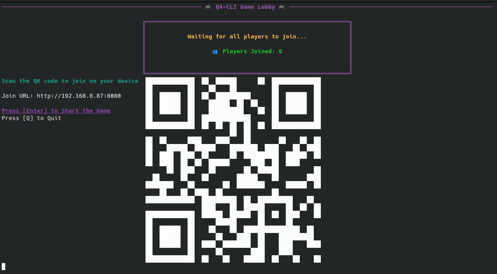
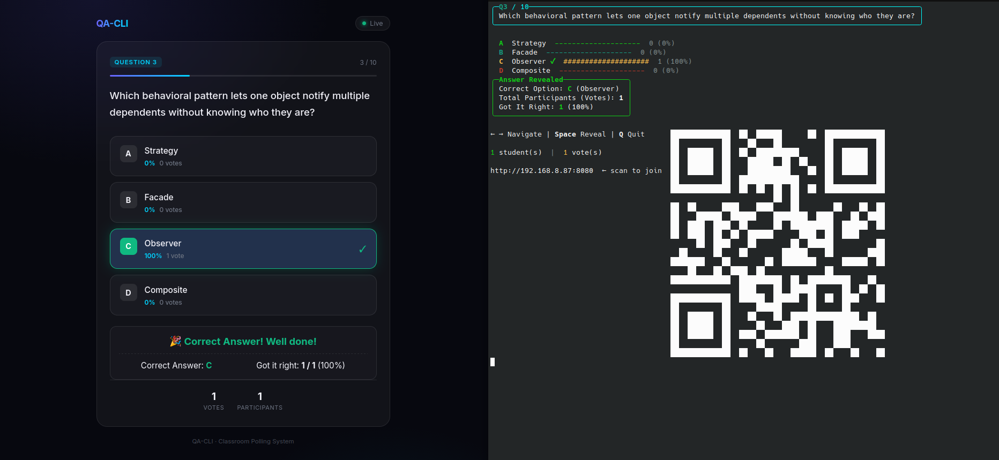
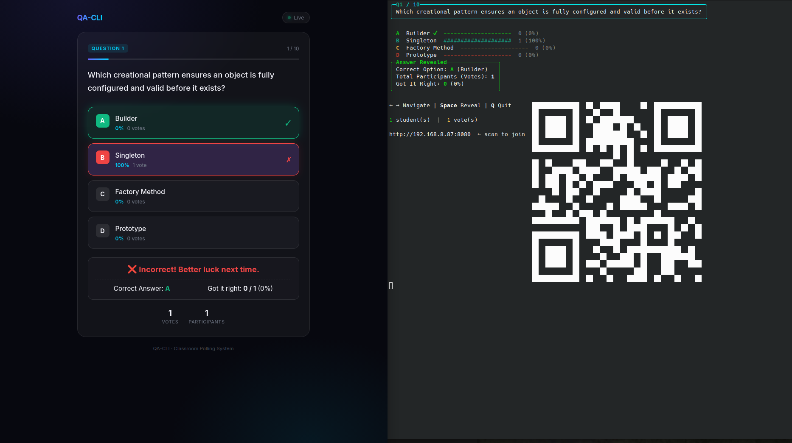
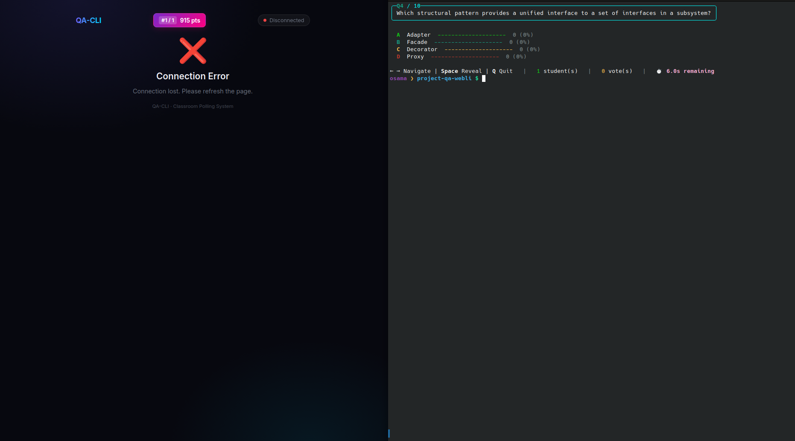
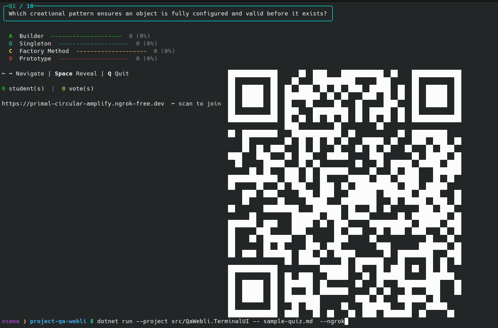
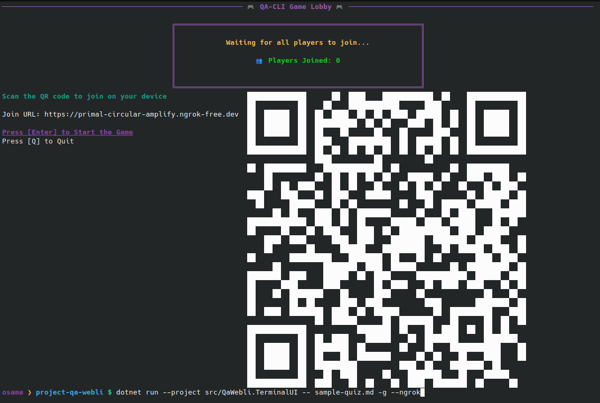
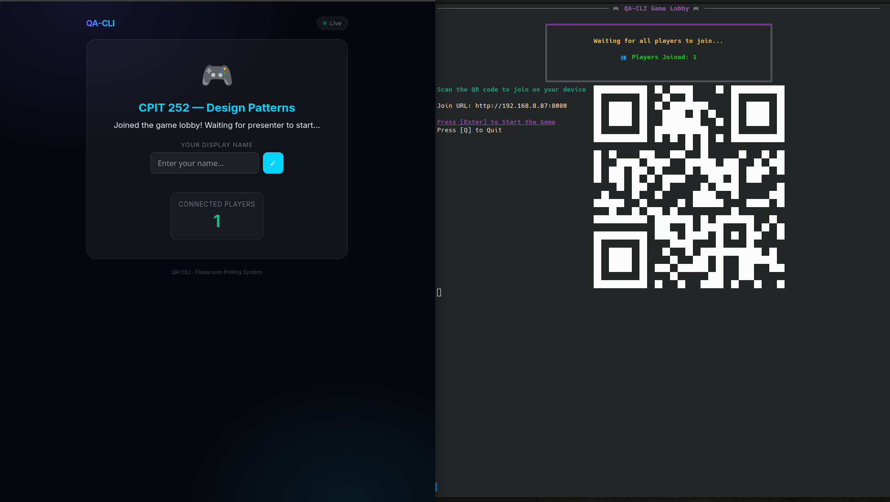
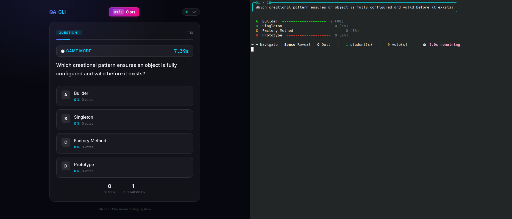
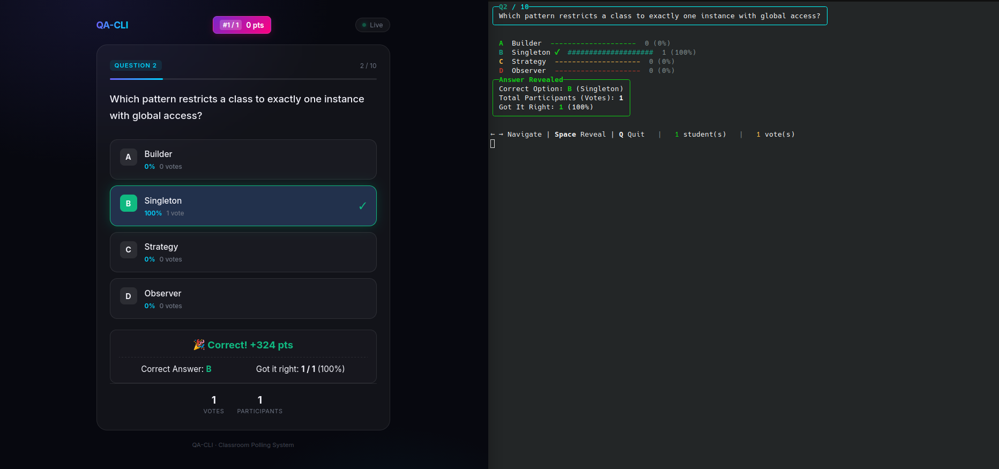
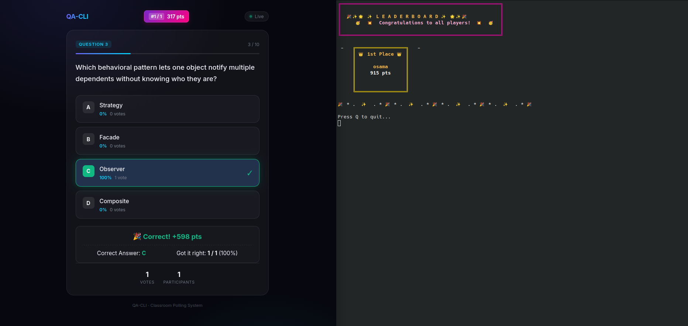

# QA-CLI

*(QA = Question & Answer | CLI = Command Line Interface)*

## What it does

You run **one terminal app** as the presenter: it shows each question with **syntax-highlighted code blocks** (coloured keywords, strings, comments), live vote totals as bars, an **ASCII QR code** for easy join, and how many participants are connected. Everyone else opens a **simple join URL** in a normal phone or laptop browser; votes sync over WebSockets. No separate "dashboard" product—just the CLI plus the small embedded page that ships inside the binary.

## Features

- **Terminal-first presenting** — Spectre.Console panels, keyboard navigation (← →), reveal correct answer with **Space**, quit with **Q**, readable in classroom lighting.
- **Syntax-highlighted code** — Keywords, strings, comments, numbers, and type names are coloured in the terminal using an escape-first pipeline. Supports C#, Python, Java, JavaScript/TypeScript, and SQL.
- **ASCII QR code** — The presenter status panel renders a scannable QR code encoding the join URL (LAN or ngrok public URL), so students can scan-to-join instantly.
- **Markdown quizzes with structure** — Questions and options parsed from `.md`; prompts can mix plain text and fenced code blocks without flattening layout.
- **LaTeX Math support** — Write inline (`$...$`) or block (`$$...$$`) math formulations; student devices render beautiful math using KaTeX, and the presenter terminal displays readable Unicode characters (like `σ`, `π`, `⋈`, `∧`, `∨`).
- **Arabic RTL support** — Arabic quiz text is reshaped for better terminal glyph joining, right-aligned in presenter views, and shown with RTL-friendly browser settings on the student page.
- **Live audience voting** — Embedded Kestrel server + WebSocket hub; students tap options; presenter sees counts and percentages update.
- **Session audit trail** — `AuditLogger` writes timestamped logs (GMT+3) under `logs/` for session lifecycle, student actions (presence, votes), answer reveals, and — in game mode — a ranked final score table. Log files are prefixed `qa-session-` or `game-session-` based on mode.
- **One-command `--ngrok`** — Pass `--ngrok` and QA-CLI starts an ngrok tunnel, shows the **public HTTPS URL** + QR code. Fails fast with a clear error if ngrok is missing or misconfigured.
- **Flexible networking** — Default LAN-friendly URL; optional `--bind` / `--port`; optional **ngrok** for a public HTTPS URL without VPN.
- **Presenter-only mode** — `--no-student-ui` skips opening any port (see [Why `--no-student-ui`?](#why---no-student-ui)).
- **Game mode (`-g`)** — Automated countdown timer per question, time-based scoring (faster correct answer = more points), intermediate leaderboards between questions, and a final podium at the end. Students see their rank and score live after each reveal. Players can set a display name in the lobby — the name appears on the terminal leaderboard instead of the raw connection ID.

## Prerequisites (read before you blame the tool)

| You want to… | You need… |
|----------------|-----------|
| **Run from source** | [.NET 8 SDK](https://dotnet.microsoft.com/download/dotnet/8.0) installed (`dotnet --version` shows 8.x). |
| **Run a release zip (v2)** | Nothing else if you use our **self-contained** builds (they bundle the runtime). You still run the program **from a terminal** (see below). |
| **Students join on your Wi‑Fi** | Presenter machine firewall allows inbound TCP on the chosen port (default **8080**). Phones must be on the **same network** unless you use ngrok. |
| **Public Internet (ngrok)** | [ngrok](https://ngrok.com/) installed and an [authtoken](https://dashboard.ngrok.com/get-started/your-authtoken) configured (see [ngrok setup](#ngrok-download-and-configuration)). |

### "I double-click the exe and nothing happens"

On **Windows**, a console app may open a window that **closes immediately** if it errors or if you are not in a terminal. **Recommended:** unzip, **Shift+right‑click** the folder → "Open in Terminal" / `Open PowerShell window here`, then run:

```powershell
.\qa-cli.exe --help
```

On **macOS** / **Linux**, open Terminal, `cd` into the unzipped folder, then `./qa-cli --help` (Linux) or `./qa-cli --help` (macOS, depending on binary name inside zip).

---

## Usage (from source)

```bash
dotnet run --project src/QaWebli.TerminalUI -- sample-quiz.md
```

```bash
dotnet run --project src/QaWebli.TerminalUI -- sample-quiz-blocks.md
```

```bash
dotnet run --project src/QaWebli.TerminalUI -- arabic-test.md
```

### CLI reference (`qa-cli --help`)

Run:

```bash
qa-cli --help
```

(or `dotnet run --project src/QaWebli.TerminalUI -- --help` from the repo)

You should see:

- **`qa-cli <quiz.md>`** — positional path to the quiz file (or **`--quiz <path>`**).
- **`--port <n>`** — TCP port for the embedded server (default **8080**). Use the **same** port in ngrok if you tunnel manually.
- **`--bind <host|ip>`** — host placed in the printed join URL (default **`0.0.0.0`** = auto-detect LAN IPv4 for display). Use your Wi‑Fi IP if auto-detect is wrong.
- **`--https`** — print join URL with `https://` (e.g. when you terminate TLS elsewhere). Local Kestrel still serves HTTP unless you add a reverse proxy yourself.
- **`--ngrok`** — start `ngrok http <port>` and show a **public** join URL + QR code. **Fails fast with a clear error** if ngrok is not available or misconfigured.
- **`--ngrok-authtoken <token>`** — pass token for this run only (writes a **temporary** ngrok config file; does not replace your global config). If omitted, **`NGROK_AUTHTOKEN`** is used when set; otherwise ngrok uses whatever you already saved with `ngrok config add-authtoken`.
- **`--no-student-ui`** — no embedded server; presenter-only (votes stay at zero unless you add another path later).
- **`-g, --game`** — enable Kahoot-style game mode with active countdowns and leaderboards.
- **`--timer <seconds>`** — time limit per question in game mode (default **10**).
- **`-h, --help`** — show usage instructions and exit.

---

## Hosting: LAN vs Internet

### 1) Same room / same Wi‑Fi (no ngrok)

1. Install prerequisites (SDK from source, or unzip a **v2** self-contained build).
2. Run:

   ```bash
   qa-cli sample-quiz.md --port 8080 --bind 0.0.0.0
   ```

3. Students can **scan the QR code** displayed in the status panel or open the printed **`http://<your-LAN-IP>:8080`** manually.
4. If they cannot connect: check **firewall**, correct **Wi‑Fi**, and try **`--bind <your.actual.ip>`**.

### 2) Hosting with ngrok (Internet) — one command

The recommended workflow is a **single command**:

```bash
qa-cli sample-quiz.md --ngrok
```

Or with a custom port and explicit authtoken:

```bash
qa-cli sample-quiz.md --port 8080 --ngrok --ngrok-authtoken "your_token_here"
```

QA-CLI starts ngrok automatically, discovers the public URL, and shows it both as text and as a **scannable QR code** in the terminal. Students scan the QR from their phones — even off your local Wi‑Fi — and they are in.

For long ngrok URLs, the terminal switches to a **more compact QR rendering** so the code fits more cleanly in the footer without forcing you to resize the presenter window as often.

If ngrok fails to start, QA-CLI **exits immediately** with a clear error instead of silently falling back to a LAN URL that students outside your network cannot reach.

#### Manual ngrok (troubleshooting)

If automatic ngrok does not work (port 4040 conflict, custom ngrok config, etc.), you can still use a second terminal:

1. Start QA-CLI on a fixed port:

   ```bash
   qa-cli sample-quiz.md --port 8080
   ```

2. In a **second** terminal:

   ```bash
   ngrok http 8080
   ```

3. Copy the **`https://....ngrok-free.app`** URL from the ngrok UI and share that. Students use **HTTPS**; WebSockets use **`wss://`** automatically on that host.

4. Optional: run QA-CLI with **`--https`** so the footer shows an `https://` URL for your LAN string too (cosmetic unless you align with your tunnel).

---

## ngrok: download and configuration

### Download ngrok

Use the official installer for your OS (keeps you on supported builds):

- **Download hub (all platforms):** [https://ngrok.com/download](https://ngrok.com/download)

Rough mapping:

| Your system | Typical download |
|-------------|------------------|
| **Windows x64** | Windows installer or zip from the download page; add `ngrok.exe` to PATH or run from its folder. |
| **Linux x64** | "Linux" tarball; unpack and move `ngrok` to e.g. `/usr/local/bin`. |
| **macOS (Apple Silicon)** | macOS ARM build; on Apple Silicon use the **ARM64** build. **Intel Mac** users should use the **AMD64** dmg/binary from the same page if applicable. |

### Configure ngrok (one-time)

1. Create a free ngrok account if you do not have one.
2. Copy your authtoken from the ngrok dashboard: [Your Authtoken](https://dashboard.ngrok.com/get-started/your-authtoken).
3. On any OS, run:

   ```bash
   ngrok config add-authtoken YOUR_TOKEN_HERE
   ```

   After this, **`qa-cli --ngrok`** can run **without** `--ngrok-authtoken` as long as you did not override config in a weird way.

**Security:** treat the authtoken like a password. Prefer **`NGROK_AUTHTOKEN`** in CI or short-lived shells instead of committing it to a repo.

---

## Why `--no-student-ui`?

- **Rehearse or demo the presenter UI** without opening a listening port (corporate laptop policies, public Wi‑Fi paranoia).
- **Air‑gapped or locked-down machines** where local firewall rules cannot be changed.
- **Debugging parsing/rendering** when student traffic is irrelevant.

You lose live remote votes in that mode unless you add another integration later—by design.

---

## Game mode

Run with `-g` to switch from presenter mode into a live game:

```bash
dotnet run --project src/QaWebli.TerminalUI -- quiz.md -g
```

With ngrok for remote participants and a custom timer:

```bash
dotnet run --project src/QaWebli.TerminalUI -- quiz.md -g --ngrok --timer 15
```

- The **lobby** screen waits for students to join and shows a live player count. Press **Enter** to start.
- Each question runs a **countdown** (default **10 s**, change with `--timer <seconds>`).
- Students who answer correctly score points — the faster they answer the higher their score.
- After each question the **intermediate leaderboard** is shown for 5 s before moving on.
- After the last question the **final leaderboard** (podium + ranked table) is shown until the presenter presses **Q**.

---

## Downloads (v2)

### Platform binaries

Self-contained, single-file executables. No .NET runtime required on the target machine.

| Platform | Archive |
|----------|----------|
| Windows x64 | [qa-cli-v2-win-x64.zip](https://github.com/cpit252-spring-26-IT1/project-qa-webli/releases/download/v2/qa-cli-v2-win-x64.zip) |
| Linux x64 | [qa-cli-v2-linux-x64.zip](https://github.com/cpit252-spring-26-IT1/project-qa-webli/releases/download/v2/qa-cli-v2-linux-x64.zip) |
| macOS ARM64 | [qa-cli-v2-osx-arm64.zip](https://github.com/cpit252-spring-26-IT1/project-qa-webli/releases/download/v2/qa-cli-v2-osx-arm64.zip) |

**Intel Mac (x64):** the macOS zip above targets **Apple Silicon** (`osx-arm64`). On an Intel Mac, build from source with `dotnet publish -r osx-x64` (see [`scripts/publish-v2.sh`](scripts/publish-v2.sh) as a template) or ask the maintainers to attach an `osx-x64` zip to the release.

### Sample quiz files

| File | Description |
|------|-------------|
| [sample-quiz.md](https://github.com/cpit252-spring-26-IT1/project-qa-webli/releases/download/v2/sample-quiz.md) | Plain-text questions only (no code blocks). Good for a quick test. |
| [sample-quiz-blocks.md](https://github.com/cpit252-spring-26-IT1/project-qa-webli/releases/download/v2/sample-quiz-blocks.md) | Questions with fenced code blocks in C#, Python, Java. Demonstrates syntax highlighting. |

Download a platform zip and at least one quiz file. Unzip the archive, place the `.md` file next to `qa-cli` / `qa-cli.exe`, open a terminal in that folder, then:

```bash
./qa-cli sample-quiz.md
```

### What is new in v2

- **Syntax highlighting** — code blocks inside questions are coloured in the terminal (keywords, strings, comments, numbers, type names).
- **ASCII QR code** — the join URL is rendered as a scannable QR code in the presenter footer, pinned to the right edge of the terminal.
- **One-command ngrok** — `--ngrok` flag starts a tunnel, discovers the public URL, and shows it with the QR code automatically.
- **LaTeX Math support** — KaTeX integration for student browsers and Unicode mapping for the terminal presenter.
- **Observer-driven UI** — vote and presence events trigger live re-renders via a decoupled `ConsoleObserver`.
- **CLI extracted** — argument parsing moved to `CliOptions`; `Program.cs` reduced to ~170 lines of clean orchestration.
- **Trimmed binaries** — self-contained zip files are ~7 MB per platform (down from ~33 MB in v1).

### For maintainers: building v2 zip files locally

From the repository root (requires `zip` + .NET 8 SDK):

```bash
chmod +x scripts/publish-v2.sh
./scripts/publish-v2.sh
```

This writes `artifacts/v2/qa-cli-v2-*.zip` and `artifacts/v2/sample-quiz.md`. Create a **GitHub Release** tagged **`v2`**, upload those zips, both sample quiz files, then the download table above resolves for everyone.

---

### Quiz file format

Quizzes are written in Markdown — see [`docs/quiz-format.md`](docs/quiz-format.md).

Arabic content can be written directly in the quiz Markdown. Use [`arabic-test.md`](arabic-test.md) as a sample for RTL question and option text.

## Testing

Run:

```bash
dotnet test QaWebli.sln
```

The current automated suite contains **16 tests** and focuses on the main project behavior:

- loading and rejecting quiz Markdown inputs
- game/session scoring and vote handling
- CLI mode flags like `-g` and `--ngrok`
- small runtime checks for the Observer and Strategy patterns used in presentation

The goal of the suite is to validate the parts of the project users actually experience, rather than exhaustively test small internal helpers.

## Troubleshooting

- **Linux inotify startup error** — If you previously saw an exception about `max_user_instances` or `FileSystemWatcher`, the embedded server now disables configuration reload watchers because this app configures Kestrel entirely in code. That avoids exhausting low inotify limits on Linux development machines.

## Screenshots

The screenshots below show the application running in its main submission modes: local classroom hosting, student web voting, ngrok public hosting, and game mode with player names, countdowns, answer reveal, and leaderboard screens.

**Local game session**



**Student correct-answer reveal**



**Student wrong-answer reveal**



**Session ended screen**



**ngrok local mode**



**ngrok game mode**



**Game lobby name entry**


**Game lobby name typing**



**Game student pre-answer screen**



**Game timer ended and answer revealed**



**Game leaderboard**



## Generative AI Declaration

Generative AI tools were used as programming assistants during this project. The full disclosure is kept in [AI_USAGE.md](AI_USAGE.md) at the repository root, including the tool categories used, project-stage summary, heavily AI-assisted files, and verification notes.

## Project Management

- [Kanban Board](https://github.com/orgs/cpit252-spring-26-IT1/projects/31)

## License

**All Rights Reserved**

Copyright (c) 2026 QA-CLI.

This project and its source code are proprietary. Unauthorized copying, modification, distribution, or use of this software, via any medium, is strictly prohibited without explicit written permission from the authors.
